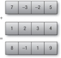

# OpenCL 3.0


 Laurent Mascarilla (et *Arnaud Revel*)<br/>
 source : [Hands On OpenCL](https://github.com/HandsOnOpenCL/Lecture-Slides/releases)

#### La Rochelle Université, <br/>Département Informatique
#### 

---

## Introduction


---

## OpenCL

- Un ordinateur moderne comporte aujourd’hui un grand nombre de
  processeurs différents :
- un ou plusieurs **processeurs généralistes**
- un ou plusieurs **processeurs spécialisés** (graphique, traitement de signaux...).
- Cette hétérogénéité rend la programmation de cette machine de plus
  en plus complexe.
- De plus, certains processeurs ne sont pas utilisés au maximum de leur
  capacité.
- Le **processeur graphique**, par exemple, est sous exploité en usage
  bureautique et pourrait être utilisé à autre chose que de l’affichage.

---

## OpenCL

- Le langage **OpenCL (Open Computing Language)** a été créé, sur une
  proposition d’Apple, dans le but de pouvoir programmer des systèmes
  parallèles hétérogènes.
- C’est un langage **dérivé du C (et C++17 pour OpenCL 2.x)** comportant certaines extensions et un  ensemble de fonctions spécifiques.
- Pour notre part, nous utiliserons son **wrapping Python (PyOpenCL)**, pour sa facilité de mise en oeuvre

---


---

## OpenCL

- OpenCL est un modèle de programmation qui exploite ce parallélisme des
  **architectures hétérogènes** :
- Il peut s’intégrer sur des **plates-formes mobiles embarquées** (téléphones, tablettes)
- sur des **calculateurs de haute performance**.
- Il peut également s’interfacer avec des API graphiques comme **OpenGL** pour afficher
  les résultats en temps réel.
- OpenCL étant un **standard**, le code de l’application est facilement **portable**
  du système d’un constructeur vers un autre puisqu’il fait abstraction des
  spécificités de la couche matérielle.
- OpenCL fonctionne sur un grand nombre de matériels.

---

- Il existe trois grands fabricants de matériels compatibles : Intel, Nvidia et AMD/ATI.
- OpenCL est supporté par tous les GPU Nvidia commercialisés depuis 2006.
- Mais en 2017 : Apple choisit Metal...
- **Khronos Group** (OpenCL, OpenGL, Vulcan...) réagit en proposant en 2020 OpenCL 3.0 qui est ...  OpenCL 1.2 + des modules (fonctionnalités de OpenCL 2.x, nouveautés) comme pour OpenGL afin qu'un maximum de plateformes le supporte.
- **Futur ?**

[OpenCL 3.0](https://www.khronos.org/opencl/)


---

## Définitions

---

## Principe de fonctionnement

Une application écrite en OpenCL est constituée de **deux** parties :

- la **première** s’exécute sur le **processeur hôte** (CPU généralement) et est chargée de :
  
  - de récupérer les informations sur l’architecture matérielle disponible
  - de configurer
  - d’ordonnancer
  - de répartir les tâches à exécuter
  - de récupérer les résultats produits.


---

- la **seconde** s’exécute sur un ou plusieurs « **devices** » c’est-à-dire des dispositifs de traitement parallèle multicœurs (GPU par exemple ou même un autre CPU).
  - les « **devices** » exécutent des petits programmes appelés « **kernel** » répartis sur l’ensemble des cœurs disponibles.
  - Ils sont écrits en **OpenCL-C** basé sur le **C99** avec quelques restrictions et extensions spécifiques pour le parallélisme.

---

  

---

- On appelle **platform** l’ensemble composé de l’hôte et d’une collection de **device** ou **compute device** compatibles OpenCL .
- Un **device** est lui-même composé d’un ensemble d’unités de calcul (**compute unit**).
- Il comporte une file d’attente de commandes (**command-queue**) permettant de réceptionner les commandes qu’il lui faut exécuter.
- Une unité de calcul (**compute unit**) est composée d’un ensemble de cœurs.

---

- La plus simple unité de traitement d’un dispositif OpenCL (**compute device**) est appelée **work-item**
- Plusieurs unités de traitement peuvent être *regroupées* en un **work-group**
- Un **work-group** s’exécute sur une unité de calcul (compute unit) au sens matériel.
- Les **work-items** à l’intérieur d’un **work-group** exécutent le même kernel.


---

## Découverte de l’environnement matériel

<pre class="stretch" data-markdown>
<code class="hjls python" style="max-height: 600px;" data-markdown data-trim data-noescape>
  import pyopencl as cl

  print('\n' + '=' * 60 + '\nOpenCL Platforms and Devices')
  # Print each platform on this computer
  for platform in cl.get_platforms():
      print('=' * 60)
      print('Platform - Name:  ' + platform.name)
      print('Platform - Vendor:  ' + platform.vendor)
      print('Platform - Version:  ' + platform.version)
      print('Platform - Profile:  ' + platform.profile)
      # Print each device per-platform
      for device in platform.get_devices():
          print('    ' + '-' * 56)
          print('    Device - Name:  ' + device.name)
          print('    Device - Type:  ' + cl.device_type.to_string(device.type))
          print('    Device - Max Clock Speed:  {0} Mhz'.format(device.max_clock_frequency))
          print('    Device - Compute Units:  {0}'.format(device.max_compute_units))
          print('    Device - Local Memory:  {0:.0f} KB'.format(device.local_mem_size/1024.0))
          print('    Device - Constant Memory:  {0:.0f} KB'.format(device.max_constant_buffer_size/1024.0))
          print('    Device - Global Memory: {0:.0f} GB'.format(device.global_mem_size/1073741824.0))
          print('    Device - Max Buffer/Image Size: {0:.0f} MB'.format(device.max_mem_alloc_size/1048576.0))
          print('    Device - Max Work Group Size: {0:.0f}'.format(device.max_work_group_size))
  print('\n')
</code>
</pre>

---

```
============================================================
OpenCL Platforms and Devices
============================================================
Platform - Name:  Intel(R) OpenCL HD Graphics
Platform - Vendor:  Intel(R) Corporation
Platform - Version:  OpenCL 2.1 
Platform - Profile:  FULL_PROFILE
    --------------------------------------------------------
    Device - Name:  Intel(R) Gen9 HD Graphics NEO
    Device - Type:  GPU
    Device - Max Clock Speed:  1050 Mhz
    Device - Compute Units:  24
    Device - Local Memory:  64 KB
    Device - Constant Memory:  4194296 KB
    Device - Global Memory: 25 GB
    Device - Max Buffer/Image Size: 4096 MB
    Device - Max Work Group Size: 256
========================================
```

---

- Le **kernel** est le programme qui s’exécute sur une unité de traitement (work-item)
- C’est un code exécutable basique similaire à une fonction écrite en langage C.
- Un **program** est une collection de kernels
- Le **context** est l’environnement au sein duquel les kernels s’exécutent incluant les dispositifs choisis, leurs mémoires partagées et leurs files d’attente de commandes (**commandqueue**), une par dispositif.

---

- Pour accueillir les données à traiter deux types d’objets existent :
  - les **buffers** (vecteur de **dimension 1**)
  - les **images** (matrice de **dimension 1, 2 ou 3**).


---

## Que mettre en mémoire ?

---

## Objets Mémoire ?
<div class="container" data-markdown>

<div class="col" data-markdown>
<section style="text-align: left;" data-markdown>

Les objets en mémoire sont des références associées à des emplacements  de la mémoire globale gérés par **reference-counting** (i.e. libérés automatiquement quand ils quittent la portée).

</section>
</div>
<div class="col" data-markdown>

- **Tampons (Buffer)** :
    Les tampons sont l’équivalent des tableaux (**1D**) en C et sont stockés de façon contiguë en mémoire.
- **Images** :
   Types **opaques** (**1D,2D,3D**), peuvent s'interfacer avec les API graphiques comme OpenGL.
</div>
</div>
En PyOpenCL les classes `Buffer` et `Image` sont dérivées de `MemoryObject`

---

## Tampons (Buffer)

---

```python
import numpy as np
import pyopencl as cl

a_np = np.random.rand(50000).astype(np.float32)
b_np = np.random.rand(50000).astype(np.float32)

ctx = cl.create_some_context()
queue = cl.CommandQueue(ctx)

mf = cl.mem_flags
a_g = cl.Buffer(ctx, mf.READ_ONLY | mf.COPY_HOST_PTR, hostbuf=a_np)
b_g = cl.Buffer(ctx, mf.READ_ONLY | mf.COPY_HOST_PTR, hostbuf=b_np)

prg = cl.Program(ctx, """
__kernel void sum(
    __global const float *a_g, __global const float *b_g, __global float *res_g)
{
  int gid = get_global_id(0);
  res_g[gid] = a_g[gid] + b_g[gid];
}
""").build()

res_g = cl.Buffer(ctx, mf.WRITE_ONLY, a_np.nbytes)
prg.sum(queue, a_np.shape, None, a_g, b_g, res_g)

res_np = np.empty_like(a_np)
cl.enqueue_copy(queue, res_np, res_g)

# Check on CPU with Numpy:
print(res_np - (a_np + b_np))
print(np.linalg.norm(res_np - (a_np + b_np)))
assert np.allclose(res_np, a_np + b_np)
```

---

```
buf = cl . Buffer ( context , flags , size =0, hostbuf=None)
```

- Un **Buffer** est un « morceau » de mémoire
- Cette mémoire n’est **pas structurée a priori** : « ensemble d’octets »
- Un buffer n’est pas lié à un device :
  - Il n’a donc **pas d’adresse fixe**
  - Les références ne survivent pas aux kernel
- Les buffer peuvent être déplacés d’un device à l’autre
- Les buffer ne sont alloués qu’à l’exécution

---
```
buf = cl . Buffer ( context , flags , size =0, hostbuf=None)
```

### Flags de création

- **READ ONLY/WRITE ONLY/READ WRITE**
  **+**
- **COPY_HOST_PTR** :
  - Utilisation de hostbuf comme source de la mémoire à copier.
- **USE_HOST_PTR** :
  - hostbuf est le buffer
  - On autorise le cache du buffer dans le device.
- **ALLOC_HOST_PTR** :
  - Nouvelle allocation sur le host (non lié à hostbuf) visible depuis le device et le host.

---

### Paramètres de Buffer

On spécifie soit le *hostbuf* soit la *taille* (plus rarement les 2)

- **hostbuf** :

  - Requiert une interface Python « Buffer » comme **numpy.ndarray**,**str**.
  - Copie du buffer vers le device :
    - **enqueue_copy(queue, dest, src)**

---

```python
prg = cl.Program(context, src)
```

- src : code OpenCL sur le device (dérivé de C99)
- Le noyau et ses attributs sont invoqués depuis le host :

```python
prg.build(options="",devices=None)

kernel = prg.kernelname(queue,(Gx,Gy,Gz), (Lx,Ly,Lz), *args)
```

- **kernelname** est le nom de la fonction kernel (en C).
- **args** peuvent être un ou plusieurs paramètres parmi  :
  - **None**
  - Un **scalaire numpy** : **numpy.int64,numpy.float32**,...
  - N’importe quel objet avec une interface buffer : **numpy.ndarray,•
    Un Buffer OpenCL, str**

---

```python
kernel = prg.kernelname(queue,(Gx,Gy,Gz), (Lx,Ly,Lz), *args)
```
- **(Gx,Gy,Gz)** définit la taille globale et la dimensionnalité des données
- **(Sx,Sy,Sz)** définit la taille locale du workgroup, si **None** il est défini par OpenCL.


- **Remarque :** les types natifs **int** et **float** de Python ne sont pas directement supportés, il faut utiliser **set_scalar_arg_dtypes()**.

---

Exemple :
```python
kernel = """
__kernel void sum(
    __global float* a,
    __global float* b,
    __global float* c,
    const unsigned int count)
{
   //  your code here
}

"""
vector_size = 1024
context = cl.create_some_context()
queue = cl.CommandQueue(context)

h_a = np.random.rand(vector_size).astype(np.float32)
h_b = np.random.rand(vector_size).astype(np.float32)
h_c = np.empty(vector_size).astype(np.float32)

d_a = cl.Buffer(context, cl.mem_flags.READ_ONLY | cl.mem_flags.COPY_HOST_PTR, hostbuf=h_a)
d_b = cl.Buffer(context, cl.mem_flags.READ_ONLY | cl.mem_flags.COPY_HOST_PTR, hostbuf=h_b)
d_c = cl.Buffer(context, cl.mem_flags.WRITE_ONLY, h_c.nbytes)

program = cl.Program(context, kernel).build()
# Utiliser obligatoirement une variable pour utiliser une seule instance (cf. doc)
prg = program.sum
prg.set_scalar_arg_dtypes([None, None, None, np.uint32])
prg(queue, h_a.shape, None, d_a, d_b, d_c, vector_size)
// ...
```

---

- **`None`** est pour les **"non-scalars"** (pointeurs).
- Pour les **scalaires** utilser le **type numpy** (ex: np.float32)

**Remarque**: il est possible de faire des **printf** dans les noyaux 
```
printf("Hello from kernel #%d, got value: %d\n", global_id, values[global_id]);
```

---

## Organisation typique de la programmation OpenCL

---


---

Après avoir choisi un device

- On crée :
  - Un contexte d’exécution
  - Une file d’attente d’exécution
  - Les objets mémoire
  - Le programme
- Celui-ci est **compilé**
- Puis lié à un kernel
- Paramétré
- Et enfin exécuté

---

```python
import pyopencl as cl
import numpy

A = numpy.random.rand(1000).astype(numpy.float32)
B = numpy.random.rand(1000).astype(numpy.float32)
C = numpy.empty_like(A)

ctx = cl.Context()
queue = cl.CommandQueue(ctx)

A_buf = cl.Buffer(ctx, cl.mem_flags.READ_ONLY | cl.mem_flags.COPY_HOST_PTR, hostbuf=A)
B_buf = cl.Buffer(ctx, cl.mem_flags.READ_ONLY | cl.mem_flags.COPY_HOST_PTR, hostbuf=B)
C_buf = cl.Buffer(ctx, cl.mem_flags.WRITE_ONLY, A.nbytes)
prg = cl.Program(ctx, """
  __kernel
  void sum(__global const float* a, __global const float* b, __global float* c){
    int i = get_global_id(0);
    c[i] = a[i] + b[i];
  }
  """).build()
prg = cl.Program(ctx,kernel).build()
prg.sum(queue, A.shape, A_buf, B_buf, C_buf)
cl.enqueue_copy(queue, C, C_buff)

```

---

## Modèles de programmation

Il existe deux façons de concevoir un programme OpenCL :
  
- Utiliser une **architecture orientée « Données »**
    - C’est le cas classique. Un même programme **(kernel) dupliqué n fois**
    accédera à une partie différente des données à traiter.
    - On appelle cette technique **SPMD** (Single Program, Multiple Data) ;

---

- utiliser une **architecture orientée «Tâches»**
  - Un work-item exécutera **une série de « tâches » (kernel) séquentiellement** pendant que les autres feront de même en parallèle mais sur des tâches différentes.
  - On pourrait ainsi transmettre (chaîner) le résultat produit par un work-item à un autre qui effectuerait dessus un traitement différent du premier.

Il est possible d’utiliser un mélange de ces deux techniques.

---

## Modèle d’exécution

  Le modèle d’exécution d’OpenCL consiste à diviser un problème complexe ou une partie de ce problème en N petites tâches parallélisables (**kernel**) puis à faire exécuter ces tâches sur **N work-items** en une seule invocation.
  

---


- Imaginons que l’on souhaite modifier chaque pixel d’une image de 1024 sur 1024 pixels.
  - On peut faire **une seule invocation d’un kernel** pour les 1 048 576 (1024 × 1024) pixels : cela crée autant d’instances du kernel qui s’exécutent en parallèle.

<div class="container" data-markdown>

<div class="col" data-markdown>

**C**

```C
void 
mul(const int n,
    const float *a,
    const float *b,
          float *c)
{
  int i;
  for (i = 0; i < n; i++)
    c[i] = a[i] * b[i];
}
```
</div>

<div class="col" data-markdown>

**OpenCL**

```C
__kernel void
mul(__global const float *a,
    __global const float *b,
    __global       float *c)
{
  int id = get_global_id(0);
  c[id] = a[id] * b[id];
}
```
</div>
</div>

---

## NDRange

- Un **NDRange** (**N-Dimensional Range**) est un espace indexé de work-items de
  dimension 1, 2 ou 3.
- Il définit comment les **work-items sont organisés** pour gérer l’espace des données à traiter.
- Chaque work-item exécute le **même kernel** mais sur des **données différentes**
  (architecture SPMD).
- Un work-item possède des **coordonnées uniques** dans l’espace indexé de dimension N appelées
  **Global ID**.

---

- Les **work-items peuvent être groupés en work-groups**.
- Chaque work-group possède également des coordonnées dans l’espace indexé de dimension N appelé **Workgroup ID**.
- Chaque work-item possède des coordonnées uniques au sein d’un work-group appelée **Local ID**.
- Global ID, Local ID et Work-group ID sont des **vecteurs dans l’espace de dimension N** et commencent à (0, 0,..., 0).

---
## Les 3 types de NDRange 


---

## NDRange à 1 dimension


---

### NDRange à 2 dimensions


---

## Connaître son indice

-  **get_global_id(dim)** :
  - indice global du work-item appelant selon la dimension **dim=0,1 ou 2**
- **get_local_id(dim)** :
  - indice local du work-item appelant
- **get_group_id(dim)**:
  - indice du workgroup auquel appartient le work-item appelant
- **get_local_size(dim)** :
  - taille de la dimension dim dans le workgroup du work-item appelant.

---

**get_global_id(dim) = get_local_size(dim)*get_group_id(dim) + get_local_id(dim)**

Même calcul que pour simuler en C un tableau 2D à partir d'un tableau 1D.

---

- Il faut bien définir le dimensionnement c’est-à-dire le **nombre et la répartition des work-items** en work-groups
- Plusieurs contraintes :
  - nombre de dimensions gérées dépend du type de device (3 au max)
  - nombre de work-items par dimension limité :
    - Un work-group regroupe plusieurs work-items 
    - Un work-group s’exécute sur une unité de calcul (compute unit).
    - Pour que l’exécution soit optimisée, il est préférable de choisir un **nombre de work-group égal au nombre de compute unit ou un multiple** de celui-ci
- **work-groups fonctionnent en parallèle**
- **nombre total de work-items dans un work-group limité**

---

## Dimensionnement et optimisation de l’algorithme

Supposons que l’on désire traiter une image (2 dimensions)
de 512 pixels sur 512
Supposons que le device comporte les caractéristiques
suivantes :

- nombre de compute unit : 4 
- nombre de dimensions gérées : 3 
- nombre maximum de work-items par dimension: 1024/1024/64
- taille maximale d’un work-group : 1024.

---


En 2 dimensions, le nombre max de work-items est de 1024

<div class="container" data-markdown>
<div class="col" data-markdown>

- On peut les répartir en 32×32 work-items.
- Si l’on utilise 4 (2 ×2) work-groups (4 compute unit).
- On a 256 (16 × 16) work-items par work group.
- Chacun des work-items gère un carré de 16 × 16 pixels de l’image
</div>
<div class="col" data-markdown>

</div>
</div>

---

## Précisions sur la gestion de la mémoire

Plusieurs types de mémoire sont définies dans OpenCL :

- La mémoire **privée** (Private Memory) :
  - C’est la mémoire **accessible seulement par un work-item**.
  - Elle est allouée spécialement pour un work-item et accessible en
    lecture et écriture.
  - Les variables définies dans la mémoire privée d’un work-item ne
    sont **pas accessibles par un autre** ;

---

- la mémoire **locale** (Local Memory) :
  - C’est la mémoire **accessible par un work-group en totalité**.
  - Seuls les work-items de ce work-group peuvent y accéder.
  - Cette mémoire est accessible en lecture et écriture ;
- La mémoire **constante** (Constant Memory)
  - Elle est accessible par la **totalité des work-items et par tous les
    work-groups**.
  - Elle n’est accessible qu’en lecture et ne peut être modifiée.
  - Elle fait partie de la mémoire globale mais reste constante
    pendant l’exécution d’un kernel ;

---

- La mémoire **globale** (Global Memory)
  - Elle est **accessible par tous les work-items et tous les work-
    groups**.
  - Elle est accessible en lecture et en écriture.

---


---

## Précisions sur la gestion de la mémoire

- La mémoire locale est de petite taille (quelques dizaine de kilo-
  octets), tandis que la mémoire globale est de grande taille (plusieurs
  gigaoctets).
- L’accès à la mémoire est **plus ou moins rapide** suivant son type.
- L’accès à la mémoire locale est extrêmement rapide à partir d’un work-item, moyennement rapide pour l’accès à la mémoire globale et lent pour les transferts de la mémoire hôte vers la mémoire globale du compute device.

---

- La mémoire privée peut être plus rapide que la mémoire locale (mais pas toujours selon l'implementation) 
- **Il convient donc de minimiser les transferts mémoire et de maximiser
  l’utilisation de la mémoire locale (et privée).**

---


---

## Espaces d’adressage dans les kernel

Les qualificatifs :

- **__global**: Mémoire partagée par tous les work-items du kernel.
- **__constant** : Mémoire en lecture seule partagée par tous les
  work-items du kernel.
- **__local** : Mémoire partagée par tous les work-items d’un même
  work-group.
- **__private** : Mémoire privée pour chaque work-item.

Remarque :  **__global** peut être remplacé par **global**, idem pour tous les autres qualificatifs.

---

## Espace d’adressage par défaut

- Pour améliorer la performance, on utilise autant que possible la
  mémoire **__local ou __private**.
- S’il n’y a pas de qualificatif, les paramètres des fonctions et les
  variables locales sont **__private**
- Le qualificatif des paramètres qui sont des pointeurs doit être
  spécifié et ne peut pas être **__private**.
- Les mémoires **__private et __local** ne sont pas préservées
  à la fin de l’exécution d’un work-item.
- La seule façon de retourner une valeur à l’hôte est via la mémoire
  **__global**.

---

# Synchronisation

---

  ### Règle d’or
- Le résultat d’un algorithme doit être **indépendant de l’ordre d’exécution
  des work-groups**

Conséquences :

- Les work-groups peuvent lire les mêmes informations depuis la mémoire globale.
 
 -  Mais **2 work-groups peuvent écrire des informations différentes dans la mémoire globale** : danger !

---

Plusieurs types de synchronisation sont possibles :


- A l’intérieur d’un work-group
  - Les work-items d’un work-group peuvent être synchronisés grâce à la présence d’une commande spéciale appelée **barrier()** au sein même du kernel.
- Le principe est que tous les work-items doivent atteindre et exécuter cette commande avant que le groupe soit autorisé à continuer le programme.
  
---

### Barrière ?


---


---


---


---

## Les ≠ avatars de la synchronisation

- Intra-group : **barrier**
  - Si la synchro se fait sur des variables **locales** :
  
  ```
  barrier(CLK_LOCAL_MEM_FENCE)
  ```
  
  et sur des variables globales (**buffer** ou **images**)
  
  ```
  barrier(CLK_GLOBAL_MEM_FENCE)
  ```
- Inter-groupes : au démarrage d’un Kernel
- CPU-GPU: Command queues, Events

---

- **Attention** : une synchronisation entre work-items appartenant à des work-groups différents n’est pas possible.

---

Plusieurs types de synchronisation sont possibles :

- A l’intérieur d’une file d’attente de commandes (**command-queue**)
  - Dans une command-queue, on ajoute une commande particulière appelée **enqueuebarrier**.
  - Les commandes empilées par la suite ne pourront être exécutées que **lorsque les commandes précédentes auront été terminées**.
  - Toute modification en mémoire est disponible pour les commandes suivantes dans la file d’attente.
  - La synchronisation n’est possible **qu’à l’intérieur de la file d’attente.**
  

---


- Par **événements**
  - à chaque commande placée dans la file d’attente est associé un objet
    « événement » qui permet de suivre son cycle de vie (soumise, en cours
    d’exécution, terminée...) mais également d’effectuer des synchronisations.
  - On peut par exemple définir qu’**une tâche A commence lorsqu’une tâche B est terminée**.
  - Lorsqu’une commande met à jour des données, en utilisant ce procédé, on s’assure que les commandes qui attendent que l’événement survienne
    disposent des objets mis à jour avant de s’exécuter.
  - La synchronisation est possible entre des files d’attente différentes.

---

# L'exemple classique: <br/>la multiplication matricielle

---

On souhaiterait **multiplier 2 matrices A et B  de taille NxN**

La matrice résultante C est constituée d’éléments dont la valeur est
égale au produit scalaire de la ligne sur laquelle il se trouve par la
colonne sur la laquelle il se trouve.


---

## Implémentation séquentielle (en C)
```C
void mat_mul(int N, float *A, float *B, float *C) {
    int i, j, k;
    for (i = 0; i < N; i++) {
        for (j = 0; j < N; j++) {
            C[i*N+j] = 0.0f;
            for (k = 0; k < N; k++) {
            C[i*N+j] += A[i*N+k] * B[k*N+j];
            }
        }
    }
}
```

---

## Implémentation OpenCL
```C [3-5|6-8]
__kernel void mat_mul(const int N, __global float *A, __global float *B, __global float *C) {
    int i, j, k;
    // Les boucles sont transformées en calculs parallèles
    i = get_global_id(0);
    j = get_global_id(1);
    // il ne reste que le produit scalaire
   for (k = 0; k < N; k++) {
       C[i*N+j] += A[i*N+k] * B[k*N+j];
   }
}
```

---
## Petite optimisation usuelle
Plutôt que d’effectuer directement le calcul sur la variable C (buffer), on passe par une variable intermédiaire (privée)

```C [6|6,8|9]
__kernel void mmul(const int N,__global float *A,__global float *B,
__global float *C) {
    int k;
    int i = get_global_id(0);
    int j = get_global_id(1);
    float tmp = 0.0f;
    for (k = 0; k < N; k++) 
        tmp += A[i*N+k]*B[k*N+j];
   C[i*N+j] += tmp;
}

```

---

## Un peu plus d’optimisation
- On peut gagner en performance en utilisant des work-groups
- Considérons qu’**un work-item effectue le calcul pour une ligne entière de C**


---

- Chaque ligne de C est regroupée dans un work-group

```C
__kernel void mmul(const int N, __global float *A, __global float *B,
__global float *C) {
    int j, k;
    int i = get_global_id(0);
    float tmp;
    for (j = 0; j < N; j++) {
        tmp = 0.0f;
        for (k = 0; k < N; k++)
            tmp += A[i*N+k]*B[k*N+j];
        C[i*N+j] = tmp;
        }
}
```

---

## Un peu plus d’optimisation
- On peut noter que sur une **ligne de C**, chaque élément utilise la **même ligne de A**
- On peut accélérer le calcul en copiant cette ligne dans une **mémoire privée** du
work-item (1 fois), ce qui évite d’aller chercher les éléments dans la mémoire
globale.


---

### Ligne de A en mémoire locale
Copier une ligne de A en mémoire privée avant le début de la multiplication

```C [7-12]
__kernel void mmul(const int N, __global float *A, __global float *B,
                   __global float *C) {
  int k;
  int j;
  int i = get_global_id(0);
  float tmp;
  float Awrk[1024]; // Mémoire privée

  // copie de la ligne de A en memoire privée
  for (k = 0; k < N; k++) {
    Awrk[k] = A[i * N + k];
  }

  // Multiplication d'une ligne entière
  for (j = 0; j < N; j++) {
    tmp = 0.0f;
    for (k = 0; k < N; k++) {
      tmp += Awrk[k] * B[k * N + j];
    }
    C[i * N + j] = tmp;
  }
}
```
**Awrk** : mémoire privée, peut être plus grand que nécessaire.

---

## Encore plus loin dans l’optimisation
- On a déjà vu que le calcul d’un élément d’une ligne de C utilise seulement une ligne de A
- De la même manière, si un work-item d’un work-group correspond à une ligne différente, chaque work-item dans un work-group utilise la **même colonne de B**
- On peut donc stocker une colonne de B en **mémoire locale** qui est visible par tous les work-item d’un work-group
- On doit cependant **synchroniser** les calculs de la mémoire locale grâce à une **barrière**

---


---

## Une colonne de B est partagée entre les work-item

```C [14-18 | 20,28]
__kernel void mmul(const int N, __global float *A, __global float *B,
                   __global float *C, __local float *Bwrk) {
  int k, j;
  int i = get_global_id(0);
  int iloc = get_local_id(0);
  int nloc = get_local_size(0);

  // Copy the row of A into private memory.
  float Awrk[256];
  float tmp;

  for (k = 0; k < N; k++) 
        Awrk[k] = A[i * N + k];

  for (j = 0; j < N; j++) {
    // Initialisation de la colonne
    for (k = iloc; k < N; k += nloc) 
        Bwrk[k] = B[k * N + j];

   barrier(CLK_LOCAL_MEM_FENCE);

    tmp = 0.0f;
    for (k = 0; k < N; k++) {
        tmp += Awrk[k] * Bwrk[k];
    }
    C[i * N + j] = tmp;

    barrier(CLK_LOCAL_MEM_FENCE);
  }
}
```

---

## Vers l’optimisation ultime et au delà...
- Le nombre de work-items doit être un multiple de la taille des
vecteurs internes des devices utilisés.
- Pour optimiser encore la réutilisation des données, utiliser des
techniques de calcul par bloc
- Décomposer les matrices en blocs de manière à remplir la taille maximum
que peut prendre une mémoire privée
- Copier les blocs en mémoire locale
- Effectuer les multiplications par bloc...

---

# Concurrence entre threads

-  Comme on l’a vu, le résultat d’un algorithme doit être indépendant de
l’ordre d’exécution des work-groups or les work-item peuvent accéder
en même en lecture, mais aussi en écriture, à la **mémoire globale et locale**.
-  Pour s’assurer qu’ à chaque instant un seul accès à un élément
mémoire est possible, il est nécessaire de faire un appel explicite à
une **instruction atomique**

---

-  Les fonctions disponibles sont (cf. TP) :

```C
atomic_add, atomic_sub, atomic_xchg, atomic_cmpxchg, atomic_inc, atomic_and,
atomic_or, atomic_xor, atomic_dec, atomic_max, atomic_min
```
Exemple :

```C
__local int n;
if (get_local_id (0) == 0) {
    n = 0;
}
barrier (CLK_LOCAL_MEM_FENCE);
//...
atomic_inc (&n);
//...
}
```

---

# Les facilités de Python

---

## PyOpenCL et numpy array
- PyOpenCL intègre nativement
les structures de numpy ce qui
simplifie la gestion de la
mémoire
- Les **PyOpenCL Array** :  **Numpy array plus un buffer  OpenCL**
- La plupart des opérations de
bases sur un tableau sont déjà
implémentées et parallélisées !

---


```python
import pyopencl as cl  
import numpy as np  

context = cl.create_some_context()  
queue = cl.CommandQueue(context)  

# 2 pyopencl arrays initialisées aléatoirement
a = cl.array.to_device(queue, np.random.rand(50000).astype(np.float32))
b = cl.array.to_device(queue, np.random.rand(50000).astype(np.float32))  
# et le résultat
c = cl.array.empty_like(a)  

program = cl.Program(context, """
__kernel void sum(__global const float *a, __global const float *b, __global float *c)
{
  int i = get_global_id(0);
  c[i] = a[i] + b[i];
}""").build()  

# Place le programme dans la file (queue) et récupére le résultat dans c 
program.sum(queue, a.shape, None, a.data, b.data, c.data)  

```

---

## Map/Reduce

Modèle de programmation utilisé pour la
manipulation et le traitement de données parallélisées
- consiste à appliquer successivement les fonctions **map()**
et **reduce()**
- Dans l'étape **Map** le problème est découpé en sous-problèmes, qui sont
délègués aux unités de calcul en parallèle et traités par la fonction map qui à une valeur associe une ou des nouvelles valeurs
- Dans l'étape **Reduce** les nœuds de calcul font remonter leurs résultats à un
nœud unique qui calcule un résultat à l'aide de la fonction Reduce(réduction)
qui applique une fonction d’agrégation des autres valeurs

---

## Map

`$$y_i=f_i(x_i) \text{, où :}$$`

- `$f_i$` est une fonction sans effet de bord. 
- Souvent `$f_i=...=f_N=f$`
- `$i \in \{1,...,N\}$` 


---

Exemple de mapping : **combinaison linéaire de 2 vecteurs**

```python [14-17]
from pyopencl.elementwise import ElementwiseKernel

n = 10
a_np = np.random.randn(n).astype(np.float32)
b_np = np.random.randn(n).astype(np.float32)

ctx = cl.create_some_context()
queue = cl.CommandQueue(ctx)

a_g = cl.array.to_device(queue, a_np)
b_g = cl.array.to_device(queue, b_np)

lin_comb = ElementwiseKernel(ctx,
    "float k1, float *a_g, float k2, float *b_g, float *res_g",
    "res_g[i] = k1 * a_g[i] + k2 * b_g[i]",
    "lin_comb"
)

res_g = cl.array.empty_like(a_g)
lin_comb(2, a_g, 3, b_g, res_g)
```

---

## Reduce

`$$y=f(···f(f(x_1,x_2),x_3),...,x_N)$$`

<div class="container" data-markdown>
<div class="col" data-markdown>

 

</div>
<div class="col" data-markdown>

Mais grâce à l'associativité :


</div>
</div>

---

## ```ReductionKernel```

 Génére un noyau qui :
- prend un certain nombre d'arguments scalaires ou vectoriels (au moins un argument vectoriel), 
- effectue le **map_expr** sur chaque entrée de l'argument vectoriel 
- et ensuite le **reduce_expr** sur le résultat.
  
Les deux autres paramètres sont : 
- **neutral** qui sert de valeur initiale. 
- **preamble** permet d'ajouter des directives de préprocesseur et des **fonctions auxiliaires** avant le code réel du noyau de réduction.

---

Exemple : **produit scalaire de deux vecteurs**
```python [4-6|8]
a = pyopencl.array.arange(queue, 400, dtype=numpy.float32)
b = pyopencl.array.arange(queue, 400, dtype=numpy.float32)

krnl = ReductionKernel(ctx, numpy.float32, neutral="0",
        reduce_expr="a+b", map_expr="x[i]*y[i]",
        arguments="__global float *x, __global float *y")

prod = krnl(a, b).get() # recupère le numpy array
```
- a et b sont des variables "fictives"
- i désigne l'élément du vecteur (parcours automatique)

---

# Digression avant de parler d'images...

---

## Vecteurs

Les microprocessors modernes disposent d'unités de calcul **"vectorielles"** :

- x86 :  MMX, SSE, et AVX (SSE = 128 bits,  AVX = 256 bits, etc)
  
  - OpenCL propose des instructions **portables** pour utiliser des vecteurs de longueur 2, 4, 8, et 16 :
    - char2, ushort4, int8, float16, double2, ...

---

```C
int4 v_iA = (int4)(7, -3, -2, 5);
// ou int4 v_iA = {7, -3, -2, 5};

int4 v_iB = (int4)(1, 2, 3, 4);
int4 v_iC = v_iA + v_iB;
```



Accès aux éléments des vecteurs par .x, .y, .z, .w

```C
float4 pos = (float4)(4.0f, 3.0f, 2.0f, 1.0f);
float4 reverse = pos.wzyx; //reverse = (1.0f, 2.0f, 3.0f, 4.0f)
float4 duplicate = pos.xxyy; //duplicate = (4.0f, 4.0f, 3.0f, 3.0f)
```

---

Mais également .even, .odd, .lo (moitié inférieure), .hi (moitié supérieure), .s0, .s1,..., sF (accès par la position de 0 à 15) ou par  `[]`:

```C
int4 a;
a.s0 = 2; // ou a[0] = 2
```

---

De **nombreuses fonctions mathématiques, logiques**... du C sont étendues aux vecteurs. Certaines sont spécifiques :

```C
int2 a=(int2)(1,2);
int2 b=(int2)(3,4);

bool sup = all(a<b); // true
```

Les **casts** sont également étendus (et compliqués). Les casts entre vecteurs de types de base différents  ne sont pas légaux

```C
int4  i;
*uint4 u = (uint4)i;  // compile error

// OK si le type de base est le même
float4 f = 1.0f;
float4 va = (float4)f;  // va is a float4 vector
                        // with elements ( f, f, f, f )

// ou avec un scalaire
float deux = 2.0f;
int2 vc = (int2)deux;   // vc is an int2 vector with elements
                        // ( (int)deux, (int)deux )
```

---

Mais il existe des fonctions de conversions :

```C
uchar4 u;
int4 c = convert_int4(u);

float4 f = (float4)(-5.0f, 254.5f, 254.6f, 1.2e9f);
uchar4 c = convert_uchar4_sat_rte(f); // c contient :
// ((uchar)0, (uchar)254,(uchar)255,(uchar)255)
```

Explication : 

- `sat` : saturation vers l'élément valide le plus proche (ici 0 ou 255)
- `rte` : arrondi à l'entier le plus proche

voir [mémo OpenCL 3.0](https://www.khronos.org/files/opencl30-reference-guide.pdf)

---


## Images

---

## En pratique

la classe `pyopencl` propose : 

```python
ImageFormat([channel_order, channel_type])
```

qui est utilisé dans : 

```python
 Image(context, flags, format, shape=None, pitches=None, hostbuf=None, is_array=False, buffer=None)
```

---

## Images ?


**Types opaques**, proches des Buffers mais :

- **Peuvent** être Optimisées par le hardware (textures GPU) : info par clGetDeviceInfo()
- Limitations :
  - Pas de tableaux d'images (~~`image2d_t img[2]`~~), mais `image2d_array_t`
  - ne peuvent être dans des `struct`

---

- **1D, 2D, 3D** : `image1d_t`, `image2d_t`, `image3d_t`
- Dans un kernel accessibles en lecture (`__read_only`) ou en écriture seule (`__write_only`) (mais pas les deux simultanément avant la version 2.0 : `__read_write`)
- les images sont toujours allouées dans la mémoire globale


---

- Les pixels **ne sont pas accessibles comme des tableaux**, emplacements mémoires pas forcement contigüs : 
  - `read_imageui, read_imagei, read_imagef` et `write_imageui, write_imagei, write_imagef`
  - stockés dans des vecteurs (ex: `float4, int4, uint4`)
  - décrits par un descripteur de format (`cl_image_format`) :
    - *channel order*: RGBA...
    - *channel type* : type du pixel (float...)

---

### Channel order

| Ordre                     | Exemples de valeurs |
|:------------------------- | ------------------- |
| CL_R, CL_Rx               | (r, 0.0, 0.0, 1.0)  |
| CL_A                      | (0.0, 0.0, 0.0, a)  |
| CL_RG, CL_RGx             | (r, g, 0,0, 1.0)    |
| CL_RA                     | (r, 0.0, 0.0, a)    |
| CL_RGB, CL_RGBx           | (r, g, b, 1.0)      |
| CL_RGBA, CL_BGRA, CL_ARGB | (r, g, b, a)        |
| CL_INTENSITY              | (I, I, I, I)        |
| CL_LUMINANCE              | (L, L, L, 1.0)      |
*x* : seulement 3 valeurs utilisées

---

## Channel type

`CL_SNORM_INT8, CL_UNORM_INT8, CL_SNORM_INT16, CL_UNORM_INT16, CL_UNSIGNED_
INT8, CL_UNSIGNED_INT16, CL_UNSIGNED_INT32, CL_SIGNED_INT8, CL_SIGNED_
INT16, CL_SIGNED_INT32, CL_HALF_FLOAT, CL_FLOAT`

--

### Note (doc. PyOpenCL)

> If you want to load images from numpy.ndarray instances or read images back into them, be aware that OpenCL images expect the x dimension to  vary fastest, whereas in the default (C) order of numpy arrays, the last index varies fastest. If your array is arranged in the wrong order in memory, there are two possible fixes for this:
> 
>    Convert the array to Fortran (column-major) order using `numpy.asarray(...,order='F')`.
> 
>   Pass `ary.T.copy()` to the image creation function.

## En clair

**lignes et colonnes sont transposées entre OpenCL et Numpy !**

---

## Exemple

```python
import pyopencl as cl
from PIL import Image

im = Image.open("image.png")
buffer = im.tobytes()

clImageFormat = cl.ImageFormat(cl.channel_order.RGBA,cl.channel_type.UNORM_INT8)

clImage = cl.Image(context,
                   cl.mem_flags.READ_ONLY | cl.mem_flags.COPY_HOST_PTR,
                   clImageFormat,
                   im.size,
                   None,
                   buffer
                  )
```

on peut aussi utiliser :

```python
from imageio import imread, imsave

#Read in image
im = imread('image.png').astype(np.float32) # type au choix...
```

---

Le noyau :

```C
__kernel void copie(__read_only image2d_t src,
    __write_only image2d_t dest,
    const sampler_t sampler,
    const float sat)
    {
        int row_id = get_global_id(0);
        int col_id = get_global_id(1);

        int2 coords;
        coords.y = row_id;
        coords.x = col_id;

        float4 pixel = read_imagef(src,sampler,coords);

        // simple copie des trois premiers plans
        write_imagef(dest,coords,pixel);
    }
```

---

## Echantillonneurs (**Sampler**)

Pour accéder aux valeurs des pixels, les fonctions de lecture (` read_image`) utilisent un sampler de type `sampler_t`:

- normalisation des coordonnées (ou non):
  `CLK_NORMALIZED_COORDS_TRUE` ou  `CLK_NORMALIZED_COORDS_FALSE`
  

---

- Mode d'adressage, passage des coordonnées données à `read_image` vers les coordonnées réelles : 

  
  
  - `CLK_ADDRESS_MIRRORED_REPEAT` et `CLK_ADDRESS_REPEAT` ne sont utilisables qu'en coordonnées normalisées
  - `CLK_ADDRESS_NONE` est le plus efficace mais il faut s'assurer que les coordonnées sont valides.

---

- Mode d'interpolation (`filter Mode`) - donne la valeur du pixel en fonction de ses voisins:
  - `CLK_FILTER_NEAREST` ou `CLK_FILTER_LINEAR` (*i.e.* interpolation bilinéaire).

- **Remarque** : pour accéder aux pixels des bords du workgroup, il faut accéder aux workgroups voisins. Donc le `__read_write`  (OpenCL 2.0) est potentiellement source de [difficultés](https://software.intel.com/en-us/articles/using-opencl-20-read-write-images)

---

## read_image/wrtite_image

Exemples de fonctions de lecture d'un pixel :

```C
float4 read_imagef(image2d_t image,sampler_t sampler, float2 coord)

float4 read_imagef(image2d_t image,sampler_t sampler,int2 coord)

uint4 read_imageui(image2d_t image, sampler_t sampler,int2 coord)

int4 read_imagei(image2d_t image, sampler_t sampler,int2 coord)

...
```

Les valeurs renvoyées sont des vecteurs de type `float,int,uint` et les coordonnées peuvent être de type `float2` : d'où l'interpolation du sampler.

---

De même pour l'écriture :

```C
void write_imagef(image2d_t image, int2 coord, float4 color)

void write_imagei(image2d_t image, int2 coord, int4 color)

...
```

---

# Références

- *Khronos*: 
https://www.khronos.org/registry/OpenCL/specs/3.0-unified/html/OpenCL_C.html

- *mémo OpenCL*:
https://www.khronos.org/files/opencl30-reference-guide.pdf

[Khronos]: https://www.khronos.org/registry/OpenCL/specs/3.0-unified/html/OpenCL_C.html

[mémo OpenCL]: https://www.khronos.org/files/opencl30-reference-guide.pdf
